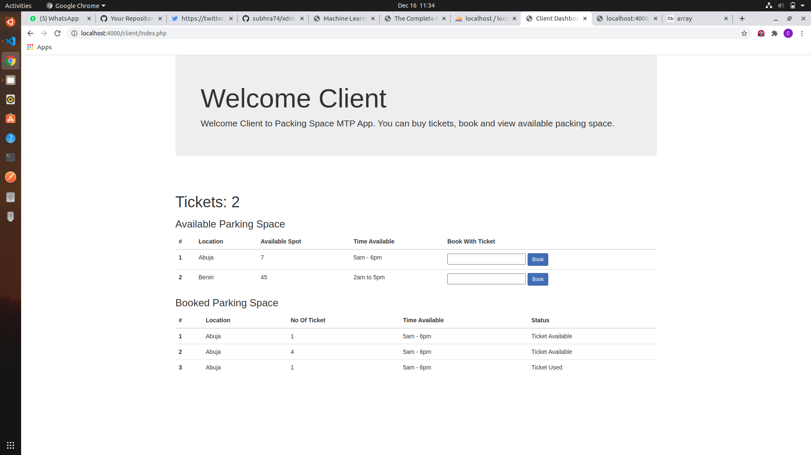
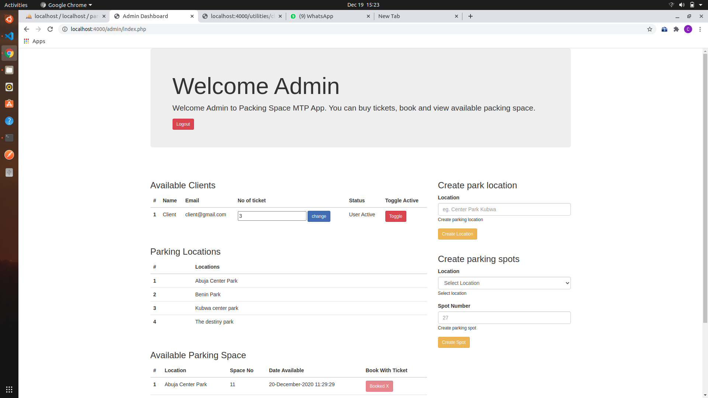

## Parking Park MTP App

**Technologies**
- PHP (Classes)
- JQuery
- Bootstrap (CSS and JS)

### Project Sample

> Both users have to be authenticated to access any of the functionality

**User: Client (Dashboard)**

Client can
- View the list of Parking Spaces for that Day
- View the number of My Tickets Available for use
- View location (e.g: UBA Space 1)
- View Status (eg Already Taken, Booked by Me, Available)
- And also Book Space...

**User: Admin (mtp app)**

Admin can
- Add/Edit/Delete New Clients, 
- Modify Number of Tickets for each Client on the List of Clients, 
- Modify number of daily available parking spaces.

> Purchase is handled offline by Admin. 

> Admin updates number of tickets purchased by a Clie

